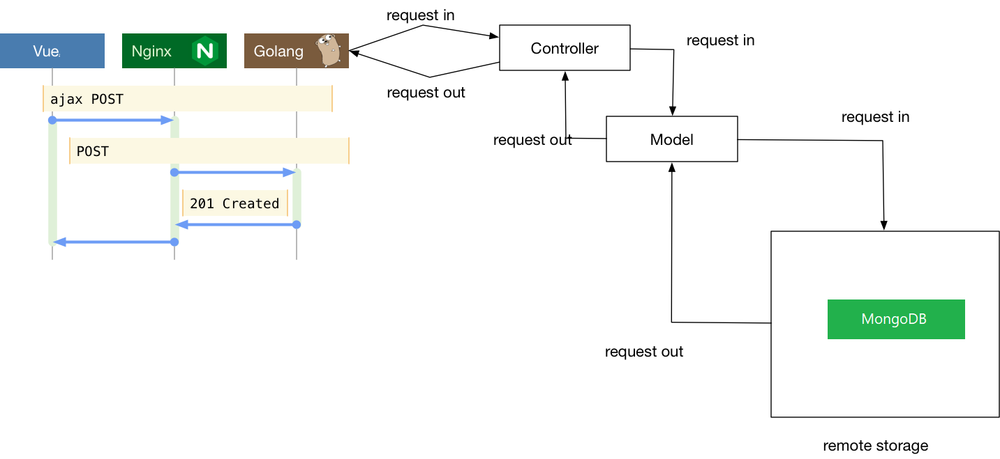
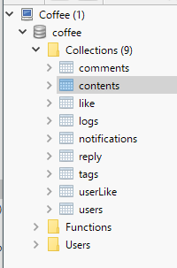

# Coffee设计文档

## 需求

​	当今，大多数人都拥有着不止一件的电子设备，比如手机、电脑、平板等。那么他们之间的数据共享就是非常迫切的需求。不仅每个人不同的电子设备之间需要数据共享，不同的朋友、同事之间也可能需要数据共享。每一个设备一对一的传输无疑是一个非常慢而且麻烦的事情。

​	比如一下情景：

- 当你在电脑上下载好一部电影，并且想把他传输到手机或平板上面看。可以直接用数据线或者无线网络复制到设备上，再使用特定的视频播放器播放，对于IOS系统可能需要更加麻烦的操作。不仅需要等待传输，还需要占用存储空间。
- 当和你的好友外出旅行之后，想要分享各自的照片。我们通常会建立一个群，然后把照片都发上去，然后每个人各自下载保存。
- 当你的工作需要在不同的地方使用不同的文件。通常我们需要使用U盘或者邮箱传递文件。
- 你想整理一下你的文件给他们标识备注，或者寻找一个文件。需要建立各种文件夹或者漫长的搜索。
- 你想拥有一个地方，可以记录你的心情或日志，既可以设为自己可见，也可以与其他人分享。
- 你想要将你电脑中各种重要的数据分门别类地备份好，并且在其他地方可以轻松访问。

Coffee专门为解决上面各种问题而设计，并且加入社交元素，可以管理和分享你的数据。

## 设计与功能

### 概述

Coffee使用前后端分离的设计。后端由高性能的Golang编写，使用灵活的MongoDB，前端使用Vue.js、ElementUI开发，可以部署到Windows、Linux和MacOS上，专门为局域网数据存储和分享设计。

### 软件架构：




使用了[Violet中央授权系统](https://github.com/XMatrixStudio/Violet)，接入XMatrix账户体系。只需一个账号就可以登陆XMatrix生态链中任何应用。

### 前端主要功能模块

主要分为**个人主页**、**广场**、**设置中心**三大模块

#### 个人主页

- **增删改** 个人账号下的不同分类下的内容
- 查看其他人的不同分类的公开内容
- 快速搜索内容

#### 广场

- 按照时间流查看（关注/热门）的公开内容
- 对内容进行全局唯一的点赞
- 对内容进行评论
- 对评论进行回复
- 下载或收藏其他人的公开内容
- 在线浏览高清图片
- 在线播放视频（下个版本推出）

#### 设置中心

- 查看和管理个人信息和成就
- 查看（系统/私信/评论/点赞/回复）的通知
- 管理个人的存储额度
- 管理系统中的用户（管理员页面）
- 各种个性化设置
- 管理个人关注（下个版本推出）


### 数据库设计

#### 总体结构


实际数据库的表：



当前V0.1版暂时9个数据表，后续版本可能会继续加入关注模块、私信模块、成就模块、管理模块、小组模块等数据表。

#### 表的设计

Coffee是一个数据管理和分享系统，因此`Contents`和`Users`为整个系统的核心所在。

##### Content

每个`Content`中，都有一个`ownID`的属性连接到`User`的`ID`， 表明内容的拥有者。

每个`Content`中，都需要可以存储各种数据类型，因此它包含了各种数据类型的子结构，根据`Type`属性来区分不同的类型的内容。每一种内容都有着其不同的数据结构，以便于存储各种不同的字段数据。其大多数类型都有着一个`File`的结构，用于表明其真实文件在系统中的存储位置。

```go
type Content struct {
	ID          bson.ObjectId `bson:"_id"`
	Name        string        `bson:"name"`        // 内容名字
	Detail      string        `bson:"detail"`      // 详情介绍
	OwnID       bson.ObjectId `bson:"ownId"`       // 作者ID [索引]
	PublishDate int64         `bson:"publishDate"` // 发布日期
	EditDate    int64         `bson:"editDate"`    // 修改日期
	LikeNum     int64         `bson:"likeNum"`     // 点赞人数
	CommentNum  int64         `bson:"commentNum"`  // 评论次数
	Public      bool          `bson:"public"`      // 是否公开
	Native      bool          `bson:"native"`      // 是否本地资源
	Type        string        `bson:"type"`        // 类型， "Movie", "Data", "Album"， "Docs", "App", "Daily"
	SubType     string        `bson:"subType"`     // 子类型 (如 "app"-"android", "windows")
	Remarks     string        `bson:"remark"`      // 备注
	Tag         []string      `bson:"tag"`         // 标签（ObjectId）
	Image       []Image       `bson:"image"`       // 预览图
	Files       []File        `bson:"append"`      // 文件集合 (可以用于存储电影字幕，软件附件等)
	Movie       Movie         `bson:"movie"`       // Movie类型专属
	Album       Album         `bson:"album"`       // Album类型专属
	App         App           `bson:"app"`         // App/Game类型专属
}

// Album 相册
type Album struct {
	Images   []Image `bson:"images"`   // 图片预览图列表
	Title    string  `bson:"title"`    // 主题
	Time     int64   `bson:"time"`     // 时间
	Location string  `bson:"location"` // 地点
}

// App 应用
type App struct {
	File    File    `bson:"file"`    // 文件
	Web     string  `bson:"web"`     // 官方主页
	URL     string  `bson:"url"`     // 下载页面或地址
	Image   []Image `bson:"image"`   // 略缩图
	des     string  `bson:"des"`     // 使用说明
	Version string  `bson:"version"` // 本地当前版本
}

// File 文件系统数据
type File struct {
	File  string `bson:"file"`  // File 文件系统的路径
	Size  int64  `bson:"size"`  // FileSize 文件大小
	Title string `bson:"title"` // Name 文件名（标题，并非真实文件米）
	Time  int64  `bson:"time"`  // Time 上传时间
	Count int64  `bson:"count"` // Count 下载次数
	Type  string `bson:"type"`  // 文件类型
}

// Image 图片
type Image struct {
	Native bool   `bson:"native"` // 是否本地资源
	File   File   `bson:"file"`   // 文件地址
	URL    string `bson:"url"`    // 在线地址
	Thumb  string `bson:"thumb"`  // 缩略图
}

// Movie 电影
type Movie struct {
	File    File    `bson:"file"`    // 文件系统
	URL     string  `bson:"url"`     // 在线地址
	Image   []Image `bson:"Image"`   // 预览图
	Type    string  `bson:"type"`    // 类型
	Detail  string  `bson:"detail"`  // 介绍链接 (后期可以接入豆瓣API，自动获取电影详情)
	Watched bool    `bson:"watched"` // 是否已看（个人属性）
}

```

##### User

`User`是基于Violet中央授权系统设计的，存储了一些必要的安全数据（如Token之类）还有一些用户在本系统中的的个人数据。主要是用户的类型和存储空间管理

```go
// User 用户基本信息
type User struct {
	ID       bson.ObjectId `bson:"_id"`   // 用户ID
	VioletID bson.ObjectId `bson:"vid"`   // VioletID
	Token    string        `bson:"token"` // Violet 访问令牌
	Email    string        `bson:"email"` // 用户唯一邮箱
	Class    int           `bson:"class"` // 用户类型
	Info     UserInfo      `bson:"info"`  // 用户个性信息

	MaxSize    int64 `bson:"maxSize"`    // 存储库使用最大上限 -1为无上限 单位为KB
	UsedSize   int64 `bson:"usedSize"`   // 存储库已用大小 单位为KB
	SingleSize int64 `bson:"singleSize"` // 单个资源最大上限 -1为无上限

	FilesClass []string `bson:"filesClass"` // 文件分类

	LikeCount      int64     `bson:"likeCount"`      // 被点赞数
	ContentCount   int64     `bson:"contentCount"`   // 内容数量
	MaxLikeCount   int64     `bson:"maxLikeCount"`   // 最大被点赞数 （用于统计用户经验）
	CommentTime    time.Time `bson:"commentTime"`    // 最后一次评论时间
	ContentTime    time.Time `bson:"contentTime"`    // 最后一次发布内容时间
	FollowerCount  int64     `bson:"followerCount"`  // 被关注数目
	FollowingCount int64     `bson:"followingCount"` // 关注数目
	Exp            int64     `bson:"exp"`            // 经验
}

// UserInfo 用户个性信息
type UserInfo struct {
	Name   string `bson:"name"`   // 用户昵称
	Avatar string `bson:"avatar"` // 头像URL
	Bio    string `bson:"bio"`    // 个人简介
	Gender int    `bson:"gender"` // 性别
}

// 用户类型
const (
	ClassBlackUser int = iota
	ClassLimitUser
	ClassNormalUser
	ClassVerifyUser
	ClassVIPUser
	ClassAdmin
	ClassSAdmin
)
/*
Class 用户类型
- 0： 黑名单用户
 - 无任何权限(无法登陆)
- 1： 受限用户
 - 浏览
- 2： 普通用户
 - 浏览
 - 下载
 - 评论
 - 点赞
 - 发布内容
- 3： 认证用户
 - 继承普通用户权限
 - 上传图片
 - 上传文件
- 4： VIP用户
 - 继承认证用户权限
 - VIP功能
- 5： 管理员
 - 继承VIP用户权限
 - 调整VIP及以下的用户级别
 - 调整VIP及以下的用户存储库大小限制
 - 删除任意公开评论
 - 删除任意公开内容(调整为私有)
- 6： 超级管理员
 - 继承管理员权限
 - 调整任意用户级别
 - 修改系统设置

Size 存储库分配
- 认证用户
 - 最大8G， 单个2G
- VIP用户 - 高级用户
 - 最大128G， 单个8G
- VIP用户 - 超级用户
 - 最大1024G， 单个128G
- 管理员
 - 无上限
- 超级管理员
 - 无上限
*/

// 性别
const (
	GenderMan int = iota
	GenderWoman
	GenderUnknown
)
```


围绕着`Users`，设计了评论、点赞、通知等模块。

##### Reply & Comments

评论分为文章评论和对于评论的回复，我一直在思考评论怎么才能清楚地把回复、楼中楼、分页、回复人等关系表达清楚。最后采用了评论和回复两种结合起来的解决方案。

把回复和评论区分开来，有利于用户一眼可以区分出哪些是对于内容的评论，哪些是对于评论的回复，这两种的主体谈论对象是完全不同的。对于回复，也需要很明确地表达出来是哪两者的对话。

分开来还有一个好处，就是可以很简单地回去前N条评论，对于评论的分页加载功能是十分有帮助了。

因此使用了`reply`和`comments`两个表来分别存储回复和评论。但是他们的表的结构都是一样的。


```go
// Comment 评论
type Comment struct {
	ID        bson.ObjectId `bson:"_id"`
	ContentID bson.ObjectId `bson:"contentId"` // 内容ID
	FatherID  bson.ObjectId `bson:"fatherId"`  // 内容用户ID
	UserID    bson.ObjectId `bson:"userId"`    // 评论用户ID
	Date      int64         `bson:"date"`      // 发布时间
	Content   string        `bson:"content"`   // 评论内容
	LikeNum   int64         `bson:"likeNum"`   // 点赞数
}
```

##### UserLIkes & Like

对于点赞，需要保证不重复，即一个用户不能对一个内容点多次赞，因此需要把点赞过某内容的所有用户或者用户点赞过的所有内容记录下来。由于需要渲染用户是否对某内容点过赞，因此存储用户点赞过的所有内容，然后把内容ID发送给前端，由前端去判断是否点过赞的效率会更高，当然，每次点赞后端都需要做检测，是否已经点击过，如果没有，就把id加到集合中，并且把点赞数增加。

这里使用了`userLike`记录了用户所有的电脑的内容ID，使用`like`记录内容的所有点赞用户的ID

```go
// Gather 集合
type Gather struct {
	ID  bson.ObjectId `bson:"_id"`
	MID string        `bson:"id"`  // MID 【索引】(ID可以是内容，可以为评论，甚至可以是用户(关注系统))
	IDs []string      `bson:"ids"` // ID集合
}
```

##### Nofification

通知系统，对于每个用户创建一个条目，存储他们收到的通知。

```go
// Notification 用户通知
type Notification struct {
	ID            bson.ObjectId        `bson:"_id"`
	UserID        bson.ObjectId        `bson:"userId"`        // 用户ID 【索引】
	Notifications []NotificationDetail `bson:"notifications"` // 通知集合
}

// 通知类型
const (
	// 系统通知
	TypeSystem = "system"
	// 点赞通知
	TypeLike   = "like"
	// 回复通知
	TypeReply  = "reply"
	// 关注通知
	TypeFollow = "follow"
)

// NotificationDetail 通知详情
type NotificationDetail struct {
	ID         bson.ObjectId `bson:"_id"`
	CreateTime int64         `bson:"time"`
	Content    string        `bson:"content"`  // 通知内容
	SourceID   string        `bson:"sourceId"` // 源ID （点赞人）
	TargetID   string        `bson:"targetId"` // 目标ID （点赞文章）
	Read       bool          `bson:"read"`     // 是否已读
	Type       string        `bson:"type"`     // 类型： "system", "like", "reply"...
}
```

#### 缓存

由于在评论区等一些地方经常需要根据用户ID批量查询用户的基本信息，如昵称、头像等，因此对于每个用户都去数据查询效率是很低的，因此我在服务端的设计过程中，加入了一个Map的数据结构，把读取过的用户基本信息(很少部分的必要信息)存储在内存中，如果再次读取只需要从Map中读取即可，大大减少了数据库的I/O


## 使用场景

- 部署到校园网个人地址上。整个校园网范围内都可以访问和共享你的资源，并且享受校园网内网10M/s+的速度。
- 使用微型电脑（如树莓派）外接硬盘，作为网络附属存储（NAS）在局域网内7*24小时使用。
- 部署到高带宽云服务器上。整个广域网都可以访问共享资源。


