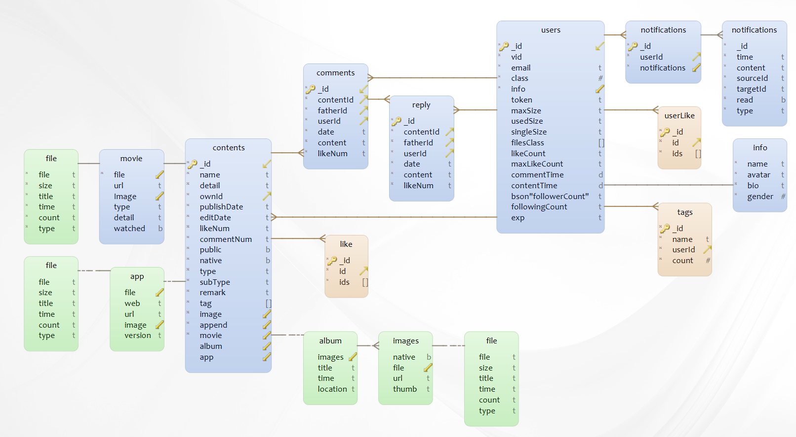

# Coffee

## 简介：

使用 Coffee 可以管理和分享你的数据。

Coffee后端基于Golang和MongoDB，前端使用Vue.js、ElementUI开发，可以部署到Windows、Linux和MacOS上，专门为局域网数据存储和分享设计。

Github地址： [服务端](https://github.com/XMatrixStudio/Coffee) [前端](https://github.com/XMatrixStudio/Coffee.Web)

只需要在局域网内的一台设备上部署Coffee，可以在PC、平板、手机上共享你的图片、电影、文档、应用、游戏等数据。

电影太大？拷贝不方便？Coffee可以使用全部内网带宽，以10M/s~100M/s的速度的速度分享你的电影。

电影没看完，想在床上躺着看？把电影保存到Coffee上，只需在同一WIFI下，可以让你无压力在线播放4K视频。

想与你的好友分享你的相册？只需要把你的相册设置为公开，你的好友就可以在Coffee上查看你的相册，下载高清大图

[在线DEMO](https://coffee.zhenly.cn)

注意：由于Coffee是为局域网设备设计优化的，这里只提供一个简单的在线DEMO，并不具有Coffee的全部功能

## 数据库

Coffee采用MongoDB作为数据库，使用Golang作为服务端语言。

结构：

实际数据库的表:

当前V0.1版暂时9个数据表，后续版本可能会继续加入关注模块、私信模块、成就模块、管理模块、小组模块等数据表。

### 设计

Coffee是一个数据管理和分享系统，因此`Contents`和`Users`为整个系统的核心所在。

每个`Content`中，都有一个`ownID`的属性连接到`User`的`ID`， 表明内容的拥有者。

每个`Content`中，都需要可以存储各种数据类型，因此它包含了各种数据类型的子结构，根据`Type`属性来区分不同的类型的内容。每一种内容都有着其不同的数据结构，以便于存储各种不同的字段数据。其大多数类型都有着一个`File`的结构，用于表明其真实文件在系统中的存储位置。

围绕着`Users`，我设计了评论、点赞、通知等模块。

评论分为文章评论和对于评论的回复，我一直在思考评论怎么才能清楚地把回复、楼中楼、分页、回复人等关系表达清楚。最后采用了评论和回复两种结合起来的解决方案。

把回复和评论区分开来，有利于用户一眼可以区分出哪些是对于内容的评论，哪些是对于评论的回复，这两种的主体谈论对象是完全不同的。对于回复，也需要很明确地表达出来是哪两者的对话。

分开来还有一个好处，就是可以很简单地回去前N条评论，对于评论的分页加载功能是十分有帮助了。

对于点赞，需要保证不重复，即一个用户不能对一个内容点多次赞，因此需要把点赞过某内容的所有用户或者用户点赞过的所有内容记录下来。由于需要渲染用户是否对某内容点过赞，因此存储用户点赞过的所有内容，然后把内容ID发送给前端，由前端去判断是否点过赞的效率会更高，当然，每次点赞后端都需要做检测，是否已经点击过，如果没有，就把id加到集合中，并且把点赞数增加。

### 缓存

由于在评论区等一些地方经常需要根据用户ID批量查询用户的基本信息，如昵称、头像等，因此对于每个用户都去数据查询效率是很低的，因此我在服务端的设计过程中，加入了一个Map的数据结构，把读取过的用户基本信息(很少部分的必要信息)存储在内存中，如果再次读取只需要从Map中读取即可，大大减少了数据库的I/O

